 

**Não inventamos o futuro; lembramos dele.**

 

&nbsp;

&nbsp;

  

 

---

 

## O sinal

Os algoritmos de uma civilização resiliente já foram escritos.

Há mais de um bilhão de anos, sob cada metro quadrado de floresta, quilômetros de hifa roteiam
nutrientes, distribuem informação, isolam ameaças e regeneram a morte em vida. Sem centro de
comando. Sem ponto único de falha. Com capacidade de refazer rotas depois de qualquer dano.

**É o histórico operacional mais longo de que dispomos — e ele está debaixo dos nossos pés.**

Construímos nossas instituições em outra gramática: extração, progressão linear, silos rígidos.
Aprendemos a converter estoque em resultado com uma eficiência impressionante.

O Mycoregenverse é um ponto de transmissão: documentação viva de uma prática na fronteira onde a
inteligência terrestre encontra a arquitetura humana.

 

## A rede

Quatro frentes. Uma só rede.

<table>
<tr>
<td width="50%" valign="top">

### `01` · Design de Bio-Sistemas

Mapeamos onde as decisões moram, como a informação circula e o que sustenta o comportamento
que serve ao conjunto. Fluxo de informação, regras, objetivos e paradigma **antes** de
parâmetros e números — é onde a mesma energia de intervenção rende dez vezes mais.

</td>
<td width="50%" valign="top">

### `02` · Cultura Regenerativa

Estruturas que sustentam tempo cíclico, gestão de longo prazo e conhecimento enraizado no
lugar. Cultura é conhecimento ecológico comprimido: o que uma organização repete sem pensar
é o que ela sabe de verdade.

</td>
</tr>
<tr>
<td width="50%" valign="top">

### `03` · Finanças Emergentes

Capital tratado como fluxo: para onde vai, com qual atraso, sob qual restrição. Contabilidade
de múltiplos capitais — financeiro ao lado do vivo, do social, do intelectual e do cultural.

</td>
<td width="50%" valign="top">

### `04` · Arquitetura Narrativa

A linguagem com que uma organização diz o que está fazendo. Problemas recorrentes, soluções
testadas, vocabulário que a equipe passa a usar por conta própria. O objetivo é deixar
capacidade instalada.

</td>
</tr>
</table>

 

## O método

Uma descida em três estratos.

| | | |
|:--:|:--|:--|
| **`01`** | **Escutar** | Antes de intervir num sistema, aprendemos sua frequência. Presença sem agenda, tempo suficiente para o padrão se revelar. |
| **`02`** | **Traduzir** | Convertemos o que se observa nas ecologias miceliais e de floresta antiga em estrutura: topologia, governança, fluxos de capital, linguagem. |
| **`03`** | **Tecer** | Fios isolados não são rede. O trabalho final é conectar — pessoas, recursos e decisões — até o sistema se sustentar sozinho. |

 

## O que você encontra aqui

| Superfície | O que é |
|:--|:--|
| **Manifesto** | A tese completa: o sistema que deu certo, o atrito que o sustenta, e onde entramos |
| **Notas de Campo** | Transmissões de longa duração, observações e hipóteses estruturais |
| **Arquivo de Sonhos** | Possibilidades e anteprojetos — nunca apresentados como casos concluídos |
| **Recursos** | Uma bibliografia viva, com 153 referências verificadas |

 

## Uma nota sobre honestidade

Nada aqui é apresentado como o que não é.

Os projetos do Arquivo **não são casos concluídos** — são possibilidades, anteprojetos, trabalhos
em fase de semente. As datas marcam início e intenção, nunca conclusão. Não há depoimentos,
clientes, métricas ou imprensa inventados, porque não existem ainda.

O que já está firme — a idade, a escala, a troca regulada, o custo embutido das redes micorrízicas —
sustenta o trabalho inteiro com folga. O que segue em disputa científica, dizemos que segue.

 

## Entrar na rede

Este trabalho não é para todos. É para quem já sentiu que os sistemas que herdamos são
insuficientes para os futuros que estamos tentando construir.

Se você é um arquiteto de novos paradigmas — se trabalha na interseção de ecologia, capital,
cultura e lugar — a rede está aberta.

 

**Se o sinal ressoar, entre.**

 

 

`mycoregenverse@proton.me`

 

---

 

<b>English summary</b>

 

**Mycoregenverse** is a transmission point: living documentation of a practice at the frontier
where terrestrial intelligence meets human architecture.

For over a billion years, mycorrhizal networks have run the planet's logistics with no command
centre and no single point of failure. That is the longest operating record we have — and it is
under our feet. This practice translates those biological constraints into human systems across
four areas: **Bio-Systems Design**, **Regenerative Culture**, **Emergent Finance** and
**Narrative Architecture**.

The method is a descent in three strata — **Listen**, **Translate**, **Weave**.

Nothing here is presented as more than it is: the Archive holds possibilities and pre-projects,
never finished case studies, and there are no invented testimonials, clients or metrics.

The site is fully bilingual (pt-BR · EN).

 

## Licenças

Este repositório usa **duas licenças**, porque código e obra não são a mesma coisa.

| O quê | Licença | Significa |
|:--|:--|:--|
| **Código-fonte** | [MIT](LICENSE) | Use, modifique e redistribua à vontade |
| **Conteúdo** — textos, imagens, vídeos | [CC BY-NC-SA 4.0](LICENSE-CONTENT) | Atribua, não use comercialmente, compartilhe igual |

 

**Mycoregenverse** · © 2026 · Todos os direitos reservados

